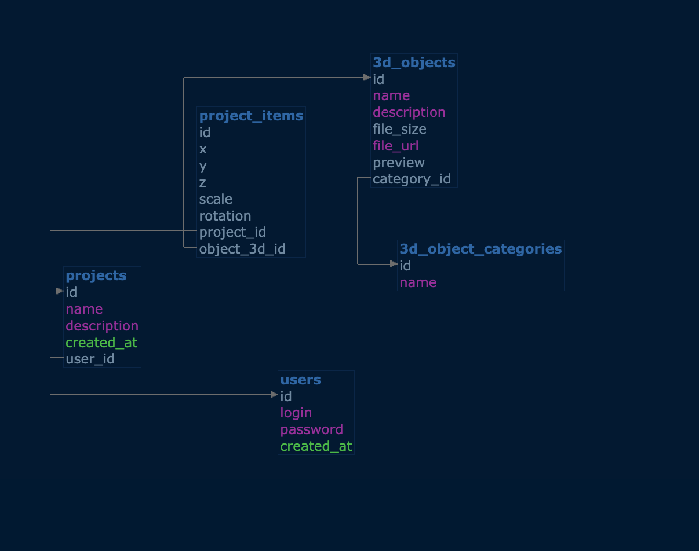
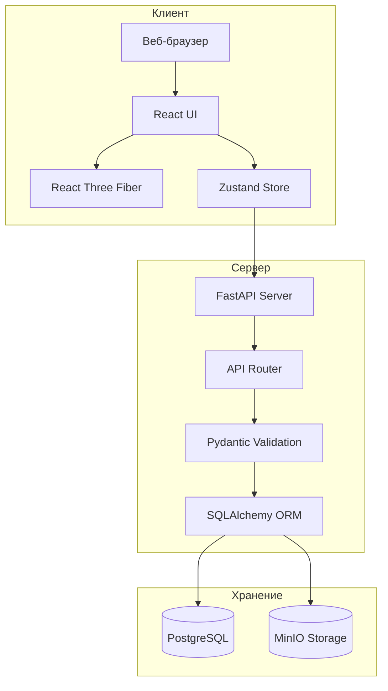

# Room Editor

Веб-приложение для создания, редактирования и визуализации 3D-интерьеров помещений в режиме реального времени.

## Описание

Room Editor позволяет пользователям проектировать интерьеры комнат, размещая и настраивая трёхмерные объекты (мебель, декор, оборудование) в виртуальном пространстве.

**Ключевые возможности:**

- Создание и управление проектами интерьеров
- Каталог 3D-моделей с категоризацией
- Размещение 3D-объектов с настройкой позиции, масштаба и поворота
- Визуализация интерьера в реальном времени (WebGL)
- Сохранение и загрузка проектов
- Управление 3D-моделями через MinIO

## Техническое задание

Полное техническое задание доступно в документе [Room Planner](https://docs.google.com/document/d/14WDud6JUOauA1b8oC-HVLzogV8KEMQaD_VdzgWhDyuU/edit?usp=sharing).

## ER-диаграмма



## Макеты интерфейса

Макеты интерфейса доступны в [Figma](https://www.figma.com/design/AmliJyM4pov2vBePiJ3PEu/roomEditor?node-id=0-1&t=ECP1i3FVWoHF4eBC-1).

## Архитектура системы



## Описание API

### Статус

- `GET /status` — жив ли сервер. Возвращает `{"status": "ok"}` если всё ок.

### Категории и 3D-объекты

- `GET /categories` — список категорий (типа "стулья", "столы" и т.д.).
- `GET /3d-objects` — все 3D-объекты. Список всей мебели что есть.
- `GET /3d-objects/{id}` — один объект по id. Даёт ссылку на скачивание модели.

### Проекты

- `GET /projects` — мои проекты. Нужен `user_id`.
- `POST /projects/create` — создать новый проект. Название, описание, юзер.
- `PATCH /projects/{id}` — поменять название или описание проекта.
- `DELETE /projects/{id}` — удалить проект.

## Запуск проекта

```bash
# Backend
cd roomEditorBackend
docker compose up -d
uvicorn app.main:app --reload

# Frontend
cd roomEditorFrontend
npm install
npm run dev
```

## Подробнее о компонентах

- **Backend** — REST API на FastAPI, работа с PostgreSQL и MinIO. Подробнее: [`roomEditorBackend/README.md`](roomEditorBackend/README.md)
- **Frontend** — React + Three Fiber для 3D-визуализации интерьеров. Подробнее: [`roomEditorFrontend/README.md`](roomEditorFrontend/README.md)
